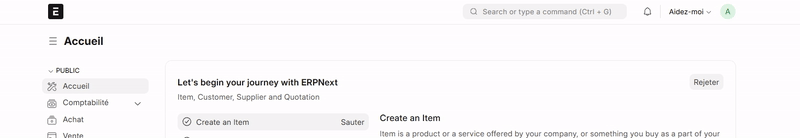
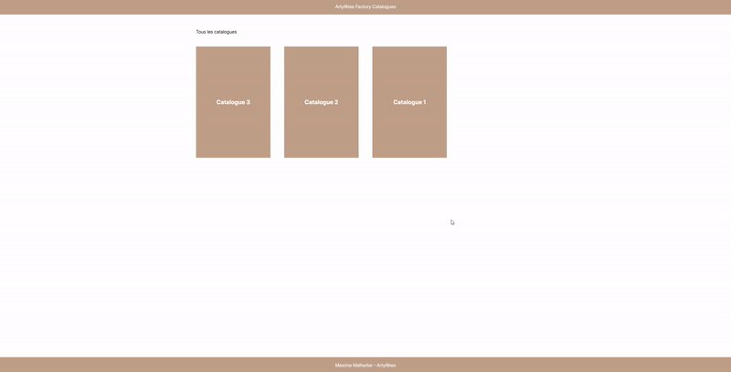

# Artyfêtes Technical Test

## Installation

You can install this app using the [bench](https://github.com/frappe/bench) CLI:

In your bench directory, run the following commands:
```bash
bench get-app https://github.com/Goramax/artyfetes_catalogs
bench --site [site_name] install-app artyfetes_catalogs
```

## ModuleDef

This app contains a custom ModuleDef called "Catalogues et univers". This ModuleDef is used to create a new module in the sidebar of the Desk. This module contains two doctypes: "Catalog" and "Linked Article".

### Catalog

The "Catalog" doctype is used to create a new catalog. It's type defines it's level and can be either "Catalog" or "Universe".
A universe has a parent catalog and can contain Items.

### Linked Article

The "Linked Article" doctype is used to link an article to a catalog. It contains a link to the article and a link to the catalog.

## Creating catalogs

To create a new catalog, access list catalog in the searchbar of Frappe. Click on "New" and fill the form. 


## Frontend

You can access the frontend of the app by accessing the frontend route. `http://[site_name]/frontend`
